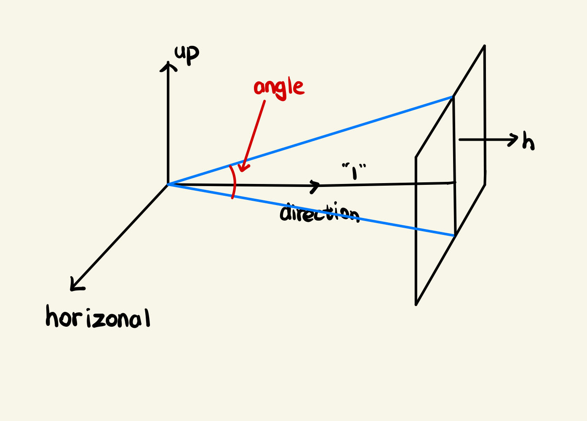
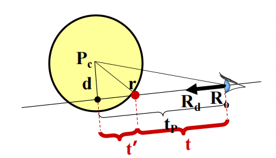

# PA1 Report

吴佳启 2022010869 计26

## 代码逻辑

### 1.txt文件内容读取

- 首先是从txt内容的读取，这里我们需要使用到一个“SceneParser”类，这个类通过输入文件的路径名来初始化，在他的构造函数中，我们会先对文件信息进行一系列的判断，然后调用“parseFile()”函数来解析文件。

这里我们可以观察到，在解析文件时，我们会根据不同的token进行不同的解析，调用不同类对应的解析函数，将类的相关信息从文本文件中抽离出来，并保存在相应的类中。

- 最终在构造函数结束后，SceneParser将读取到的各个组件的信息存储在自己相应的类中，接下来就可以通过相关函数，比如"getCamera()"来获取相机信息。

### 2. 主函数逻辑

1. 初始化工作：读取到各个组件后，主函数首先要抽离出最重要的相机信息，并将其作为渲染的起点，然后从相机中获取到生成的图片的大小属性，将最终生成的图片初始化。
2. 光线投射算法实现：

- step1：接下来就是遍历整个图片的像素，将像素和相机连接起来后发出一条光线，这个光线将和场景里所有的物体做intersect的判断，最终返回最近的那个交点，如果存在相交的情况我们再进行上色。
- step2：这里我们采用Phong模型，为了简单起见去除了环境光选择，即下列式子中$I_a$为0。

$$
I = I_a \cdot k_a + \sum_{i=1}^{n} (I_i \cdot (k_d \cdot (\mathbf{N} \cdot \mathbf{L_i}) + k_s \cdot (\mathbf{R_i} \cdot \mathbf{V})^{\alpha}))
$$

其中

$$
( I ) 是最终的光照强度；
( I_a ) 是环境光强度；
( k_a ) 是环境光反射系数；
( I_i ) 是第 ( i ) 个光源的光强度；
$$
$$
( k_d ) 是漫反射系数；
( \mathbf{N} ) 是表面法向量；
( \mathbf{L_i} ) 是第 ( i ) 个光源的入射光线方向向量；
( k_s ) 是镜面反射系数；
$$
$$
( \mathbf{R_i} ) 是第 ( i ) 个光源的反射光线方向向量；
( \mathbf{V} ) 是视点方向向量；
( \alpha ) 是镜面高光指数。
$$

具体的，我们调用material类的Shade函数来进行上色，分别计算漫反射和镜面反射的贡献，然后将这两个颜色相加，得到最终的颜色。

- step3:最终我们给这个像素点上色，逐一循环，保存图片到指定路径。

### 细节实现1：光线的射出
1. 我们获取了屏幕上的一个像素位置，接下来是计算这条光线发出的角度了，这里我们需要先约定相机的内参：
- 画布（图像）大小$(𝑤,ℎ)$
- 光心位置$(c_x,c_y)$，一般为$(w/2, h/2)$
- 视场角𝑎𝑛𝑔𝑙𝑒
2. 接下来我们需要计算的是画布上的一个单位距离对应像素的数量，这里我们需要应用到角度angle，因为我们默认的相机到画布的距离为1，我们可以得到这个计算公式：
$$
f_x = f_y = \frac h{2*tan(\frac{angle}{2})}
$$
那么我就可以很轻松的根据像素点$(u,v)$，计算出对应的光线方向了，公式如下：
$$
\mathbf{R}_c = \text{normalized}\left( \begin{bmatrix} \frac {u - c_x}{f_x} \\ \frac {v - c_y}{f_y} \\ 1 \end{bmatrix} \right)
$$

注意到，这里还有一次坐标变换的过程，即相机的射线转化到世界坐标下，这里我们有矩阵的旋转矩阵为：$\mathbf{R} = [\overrightarrow{horizontal}, -\overrightarrow{up}, \overrightarrow{direction}]$，再加上相机的坐标$\overrightarrow{t}$，我们可以得到最终射出的射线为:
$$
(t,\mathbf{R} \cdot \mathbf{R}_c)
$$
### 细节实现2：group类
1. 这里group存储着场景中的所有物体，我采用了stl中的vector实现，方便后续的循环遍历。
2. 注意group的intersect函数，我们需要枚举其中的每一个物体进行intersect判断，而这里的hit传递的是引用，我们不用在外部进行条件判断，只需要根据intersect的返回值进行return即可。
### 细节实现3：物体类：球、平面、三角形
1. 物体类中，我们需要实现intersect函数，整体思路为：计算光线与物体相交时的参数t，判断参数t是否比hit中存储的t小同时比tmin大，满足条件的话则表示更接近，那么就更新hit类中的材质、法向量、交点等信息。
2. 球类：这里我们采用偏几何的方法来实现，首先我们计算出光源和球心的距离$R$,利用投影计算出下图中的$t_p$，然后根据$R$的长度来判断光源是在球内还是外部，排出掉光源在内部且$t_p<0$的情况，接下来计算球心到射线的距离$d$，然后根据d判断射线与球心是否相交，最后根据光源和球心的关系判断最近的交点。

3. 平面：这里我们采用标准的平面方程来实现，即对平面我们有$ax+by+cz+d=0$，令$\mathbf{P}_0=(x,y,z)$，$\mathbf{n}=(a,b,c)$，同时光线方程：$P(t) = R_0 + t\cdot\mathbf{R}_d$，那么我们可以得到：
$$
(R_0 + t\cdot\mathbf{R}_d)\cdot\mathbf{n} + d = 0
$$
解方程同时满足$t>0$即可。
3. 三角形：采用重心表示法，即一个点用三角形的三个顶点来表示，$\mathbf{P} = \alpha \mathbf{A} + \beta \mathbf{B} + \gamma \mathbf{C}$,最终这个点如果落在三角形内部，那么有$\alpha+\beta+\gamma=1$且$\alpha>0,\beta>0,\gamma>0$，那么我们可以得到如下方程：
$$
(R_0 + t\cdot\mathbf{R}_d) = (1-\beta-\gamma) \mathbf{A} + \beta \mathbf{B} + \gamma \mathbf{C}
$$
化简后利用Cramer法则即可求得$t$，$\beta$, $\gamma$，验证$t$大于0，同时$\beta$, $\gamma$均大于等于0，且和小于等于1即可。
### 细节实现4：Transform类
1. 这里我们实现了一个Transform类，用来对物体进行变换，包括平移、旋转、缩放等，采用矩阵的乘法来实现，即$\mathbf{P}_1 = \mathbf{T} \cdot \mathbf{P}_0$，其中$\mathbf{T}$为变换矩阵。
2. 与常规想法不同，我们不是对物体施加这个变换矩阵，因为物体而言面片太多，在处理大规模数据时耗时太长，我们对光线做矩阵变换：
首先我们有方程如下：

$$
\mathbf{A} \cdot \mathbf{x} + \mathbf{b} = \mathbf{o} + t\cdot\mathbf{d}
$$

接下来我们要对光线做变化，求解x，得到新的方程为：
$$\mathbf{x} = \mathbf{A}^{-1}\mathbf{o} - \mathbf{A}^{-1}\mathbf{b} + t(\mathbf{A}^{-1}\mathbf{d})$$
这个是新的光线的参数，但是需要注意，这里的方向不一定单位化了，我们需要对这个方向向量做归一化。
但是这么做有一个问题，这里的t还没有做处理！因此我们需要单位化求交点后，把t除以原向量的长度，否则在测例6中会出现错误。
## 代码参考
实验过程中我并未与其他同学讨论，查看了PPT和readme文件，在出现问题时查看了习题课PPT了解到了归一化的处理方式。
## 实现中遇到的问题
1. 在开始时，我忘记了在相机发出照片后要加上旋转矩阵实现视角的变化，导致渲染出的结果始终没有图像。
2. 后面在高光处理时，我的视线V向量计算错误，导致高光始终与要求不符。
3. 最后是transform类的处理，对归一化的理解没有很深，导致t忘记归一化，在案例6中渲染错误。